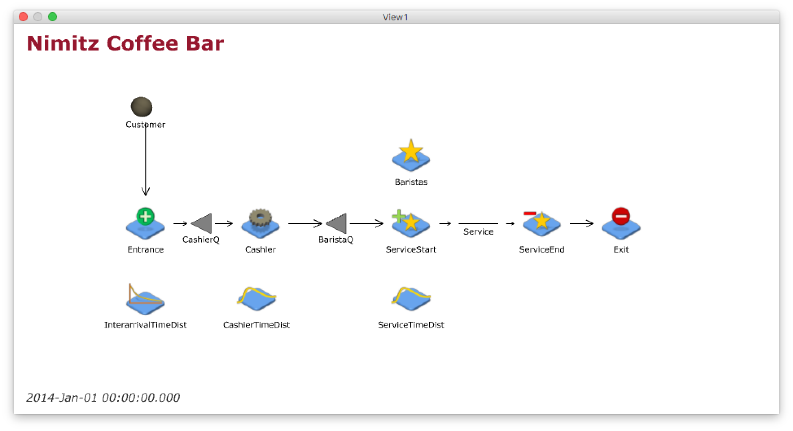

__Download the R Markdown file for this document here:__

> `https://github.com/sa421-usna/lesson-12/zipball/master`

\ 

```{r setup}
# Required packages
library(knitr)
library(ggplot2)
```

# Overview

- Setting up RStudio with the ability to "Knit to PDF."

- A few tips and tricks to polish your R Markdown documents.

- We are showing the code chunks in this document for educational purposes. You should hide your code in your reports. 


# Setup - installing MiKTeX

- [MiKTeX](https://miktex.org) is a distribution of [LaTeX](https://www.latex-project.org) (prounounced "lay-tek" or "lah-tek") for Windows.

- LaTeX is a typesetting system commonly used by mathematicians, engineers, physicists, and others.

- When you press "Knit to PDF" in RStudio, it converts your R Markdown document into LaTeX.

- Download MiKTeX from here: `https://miktex.org/download`

- Run the installer, and restart your computer.

- Open an R Markdown file in RStudio, and try knitting to PDF. You may be prompted to install some packages.


# Separate your chunks

- Make sure your R chunks are separated by at least 1 blank line. Otherwise, strange behavior can occur when knitting to PDF.

```{r}
# Print a message
print("Here's one chunk.")
```

```{r}
# Print another messsage
print("Here's another chunk.")
```


# Images

- Including an image works almost the same way as before. The R Markdown code below includes the following image right below this text.

\ 

- Note the extra `\ ` (backslash + space) at the end of the line. This prevents a caption from appearing.

- If you want to resize your images or include a caption, try the method below instead.

```{r, out.width='4in', fig.cap='Simulation flow chart', fig.pos='h', fig.align='center'}
# Take a look at the options for this chunk in the Rmd file
# Here is the image

```

- `fig.pos='h'` prevents the image from floating away to somewhere else on the page, or even to another page.

- These chunk options (`out.width`, `fig.cap`, `fig.pos`, `fig.align`) work with plots as well. Here's another example.

```{r, out.width='5in', fig.pos='h', fig.align='center'}
# Take a look at the options for this chunk in the Rmd file
# Here is a simple plot
ggplot() + 
  geom_point(aes(x = 1:10, y = 1:10)) + 
  labs(x = 'x-axis', y = 'y-axis', title = 'Title')
```

# Page breaks

- Control the page breaks in your document with `\newpage`.

\newpage

# Tables

- You can also include a caption with a Markdown table. Here is an example.

|                              | Exponential | Gamma | 
| -----------------------------| ----------: | ----: |
| Kolmogorov-Smirnov statistic | 123         | 456   | 
| AIC                          | 789         | 012   |
| BIC                          | 345         | 678   |

Table: Goodness-of-fit statistics and criteria for cashier time data. 

- You can also do the same for a `kable` table based on a data frame. Here's an example of how to do this.

```{r}
# Read in summary data
summary <- read.csv('summary.csv')
```

```{r}
# Print summary data into a nice table
# Provide proper column names
# Provide a caption
kable(summary, col.names = c('Number of levels', 
                             'Average fraction of spots occupied',
                             'Average time to find a parking spot'),
      caption = 'Predicted values from simulation experiment.')
```


# What else?

- There are many other things you can do to make your R Markdown documents look nice and professional. 

- Google is your friend, but be aware that sometimes the top results don't give the best or easiest way to accomplish something. 

- Chunk options: `https://yihui.name/knitr/options/`

- Options for knitting to PDF: `http://rmarkdown.rstudio.com/pdf_document_format.html`
